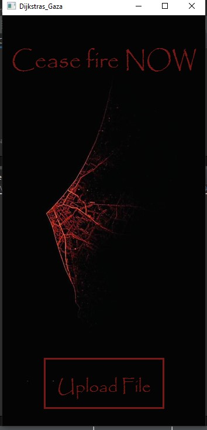

# 🌍 Gaza Cities Pathfinding Tool

**Gaza Cities Pathfinding Tool** is an optimized implementation of Dijkstra's algorithm for map-based route-finding tasks, focused on the Gaza Strip. This tool allows users to find the most efficient route between cities with the lowest travel cost.

## 📝 Project Overview

This project applies Dijkstra's shortest path algorithm to find optimal routes between cities based on Euclidean distances. The cities and their coordinates are represented on a map of Gaza, and the routes are displayed visually to provide an interactive navigation system.

## 🔧 Data Structures

The system leverages a combination of optimized data structures for efficient route finding:

- **Adjacency List for Graph Representation:** 
  - Vertices represent cities.
  - Edges represent roads with Euclidean distances as weights.
  
- **Priority Queue:**
  - Manages the shortest paths by storing vertices with the lowest known distances from the source.

- **Dijkstra's Algorithm Optimization:**
  - Reduces computation time by halting the search as soon as the destination is reached.
  - Updates only the necessary distances during repeated queries to save time.

## 💻 Main Interface

The tool offers a simple and intuitive interface where users can:

- Select cities on a map using mouse or keyboard input.
- View calculated paths on the map, highlighting the streets used for the shortest route.

## 🌍 City Data Management

City and road information is handled using a file-based system that stores:

- City coordinates (latitude and longitude from Google Maps).
- Road connections and distances calculated dynamically during runtime.

## 📊 Pathfinding Results

The tool provides detailed results, including:

- The shortest path between two selected cities.
- The total distance for the route.
- A visual display of the path on the map.

## 📹 Project Demo

[Click here to watch the project demo](https://github.com/user-attachments/assets/29ba074d-3d5a-4736-bece-029f1f023ab8)

